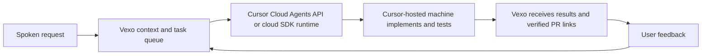

# Vexo for Cursor

From spoken requests to working code with Cursor-hosted agents.

[Vexo](https://vexoai.com) is an AI bracelet that remembers conversations and helps you follow through. We're building an integration that turns coding requests from those conversations into work performed by Cursor's agents on Cursor-hosted cloud machines, with progress and results returned to Vexo.

This repository contains the plugin that brings Vexo context and coding workflows into Cursor. The hosted task-dispatch and result-return integration is still to be implemented. See [the proposed marketplace description](MARKETPLACE.md).

Examples:

- “What did we decide about onboarding yesterday?”
- “Find the conversation where we discussed the checkout issue.”
- “Use our discussion about notifications to draft an implementation brief.”
- “Implement the onboarding changes we discussed yesterday and run the relevant tests.”

## What is included

- A remote MCP connection to Vexo's existing service.
- `vexo-context`: retrieve relevant conversation context with dates and times when available.
- `vexo-brief`: turn that context into a grounded implementation brief.
- `vexo-execute`: use that context to implement a requested task with Cursor's coding tools, validate changes, and report results.

## Cursor-hosted execution

The target workflow is:



Vexo will select the authorized task and repository, supply relevant context, track task state and spending, and present the result. Cursor will host the coding environment and execute the agent. This design does not require Vexo to provision a separate coding VM for each user.

The execution connection belongs in Vexo's backend, using the [Cloud Agents API](https://cursor.com/docs/cloud-agent/api/endpoints) or the [TypeScript SDK's cloud runtime](https://cursor.com/docs/sdk/typescript). The backend can send a task and its context directly; installing this marketplace plugin is not a prerequisite for API dispatch. The plugin supplies reusable Vexo context and workflow instructions wherever supported and configured in Cursor.

## Current status and remaining work

The package currently contains MCP connection settings and three command instructions for a Cursor session. Cursor can use its own coding tools to implement and test an authorized request. The MCP server's existing `vexo:read` scope governs access to Vexo records; it does not restrict Cursor's code-editing tools.

Hosted execution is the integration target, not a capability already delivered by this package. Remaining backend work:

- Establish Cursor account access, billing and repository authorization for each customer. A GitHub connection to Vexo alone does not establish Cursor access.
- Dispatch a durable Vexo task to a Cursor cloud agent and record the returned agent/run IDs. Recover uncertain requests without blindly launching duplicate work.
- Collect progress and artifacts, handle follow-up requests and cancellation, and synchronize terminal results to the Vexo app.
- Enforce user budgets and concurrency limits using the usage information available from Cursor. Measure startup latency and cost per completed task.
- Verify changes, test evidence and commit/PR links before reporting success. Apply the task's publication permissions; keep merge and deployment decisions explicit.

Installing the plugin does not provision Cursor model access, API credentials or a cloud worker. Authenticated plugin testing and hosted execution acceptance testing remain pending.

## Requirements and sign-in

You need Cursor with plugin support and an existing Vexo account with captured data. Use the normal Vexo sign-in and approval flow presented by the MCP client. The server advertises OAuth authorization-code flow with PKCE and dynamic client registration; there is no shared API key in this package.

The MCP endpoint is:

```text
https://vexo-backend-uj6z.onrender.com/mcp
```

This is a draft package pending marketplace submission and a complete authenticated Cursor acceptance test. It is not yet available through marketplace search.

For local testing, copy this directory into `~/.cursor/plugins/local/vexo`, reload Cursor, and check the plugin components under Customize. The local copy must be a real directory; do not use a symlink pointing outside the local plugin directory. Local plugin imports must be permitted by your organization. Follow [Cursor's plugin instructions](https://cursor.com/docs/plugins).

## Connection details

```json
{
  "mcpServers": {
    "vexo": {
      "type": "http",
      "url": "https://vexo-backend-uj6z.onrender.com/mcp"
    }
  }
}
```

The current server implements transcript search, transcript-day listing and retrieval, and voice-logged records. Its existing `vexo:read` authorization scope also covers additional read-only profile, activity, and logged-data tools. This plugin's conversation-focused commands do not narrow that server-side scope. Review the Vexo consent screen before connecting.

Retrieved data is provided to the Cursor session to answer your request. The package contains no account credentials, recordings, or backend source code. Revoke the connection through Vexo's connection controls when it is no longer needed. Do not publish personal access links or tokens in an MCP configuration.

## Validation

Run `python3 scripts/validate.py` to check package structure. Public endpoint checks verify OAuth discovery and rejection of unauthenticated MCP requests; they do not establish that authenticated tool calls succeed. Before submission, complete sign-in from Cursor, test a transcript search on the intended account, and verify revocation.

Before describing hosted execution as available, verify a real spoken request through Vexo task creation, Cursor cloud execution, recorded checks, a verified PR, and the result displayed in Vexo. Also verify cancellation, recovery without duplicate execution, customer isolation and usage attribution.

Support: support@vexoai.com
