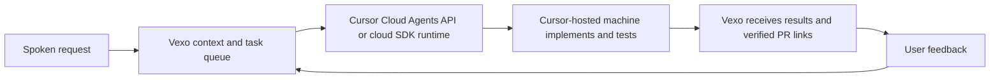

# Vexo for Cursor

From spoken requests to working code with Cursor-hosted agents.

[Vexo](https://vexoai.com) is an AI bracelet that remembers conversations and helps you follow through. We're building an integration that turns coding requests from those conversations into work performed by Cursor's agents on Cursor-hosted cloud machines, with progress and results returned to Vexo.

**Release status: in development.** We are building one complete integration for release: spoken request → Cursor-hosted execution → verified result in Vexo. Conversation retrieval, planning and execution instructions are components of that integration. The release is ready only when the complete workflow passes acceptance testing. See [the marketplace description](MARKETPLACE.md).

Examples:

- “Implement the onboarding changes we discussed yesterday and run the relevant tests.”
- “Fix the checkout issue I mentioned and open a pull request.”
- “Show me the result, then update the button using the feedback from our conversation.”

## Plugin components

These files support the full integration; their presence alone does not establish release readiness.

- A remote MCP connection to Vexo's existing service.
- `vexo-context`: retrieve relevant conversation context with dates and times when available.
- `vexo-brief`: turn that context into a grounded implementation brief.
- `vexo-execute`: use that context to implement a requested task with Cursor's coding tools, validate changes, and report results.

## Cursor-hosted execution

The target workflow is:



Vexo will select the authorized task and repository, supply relevant context, track task state and spending, and present the result. Cursor will host the coding environment and execute the agent. This design does not require Vexo to provision a separate coding VM for each user.

The execution connection belongs in Vexo's backend, using the [Cloud Agents API](https://cursor.com/docs/cloud-agent/api/endpoints) or the [TypeScript SDK's cloud runtime](https://cursor.com/docs/sdk/typescript). The backend can send a task and its context directly; installing this marketplace plugin is not a prerequisite for API dispatch. The plugin supplies reusable Vexo context and workflow instructions wherever supported and configured in Cursor.

## Work required before release

The package currently contains MCP connection settings and three command instructions for a Cursor session. Cursor can use its own coding tools to implement and test an authorized request. The MCP server's existing `vexo:read` scope governs access to Vexo records; it does not restrict Cursor's code-editing tools.

The complete hosted workflow is still under development. Required backend work:

- Establish Cursor account access, billing and repository authorization for each customer. A GitHub connection to Vexo alone does not establish Cursor access.
- Dispatch a durable Vexo task to a Cursor cloud agent and record the returned agent/run IDs. Recover uncertain requests without blindly launching duplicate work.
- Collect progress and artifacts, handle follow-up requests and cancellation, and synchronize terminal results to the Vexo app.
- Enforce user budgets and concurrency limits using the usage information available from Cursor. Measure startup latency and cost per completed task.
- Implement and verify narrowly authorized Vexo context access for hosted runs, including credential expiry and revocation. The current broad `vexo:read` grant does not provide task-limited access.
- Verify changes, test evidence and commit/PR links before reporting success. Apply the task's publication permissions; keep merge and deployment decisions explicit.

Installing the plugin does not provision Cursor model access, API credentials or a cloud worker. Authenticated plugin testing and hosted execution acceptance testing remain pending.

## Production MCP endpoint

The plugin connects to Vexo's existing production backend:

| Setting | Value |
| --- | --- |
| Render service | `vexo-prod` |
| Render environment | `Production` |
| Runtime environment | `NODE_ENV=production` |
| MCP URL | `https://api.vexoai.com/mcp` |
| OAuth issuer | `https://api.vexoai.com` |

The branded domain is served by Render with a managed TLS certificate. Production releases use a dedicated `production` branch with automatic deployment disabled. The separate studio preview is suspended and its production database credentials have been removed from its service configuration.

OAuth access and refresh tokens are checked against their originally authorized MCP resource. Tokens issued for the previous Render hostname cannot be retargeted to the new resource: existing MCP users must reconnect and approve access at `https://api.vexoai.com/mcp`.

The development status above describes the complete Cursor integration. The production MCP endpoint does not establish that hosted execution or authenticated Cursor acceptance testing is complete. Resource-bound tokens do not protect against compromise of the production server or its database credentials.

## Developer testing: MCP sign-in

You need Cursor with plugin support and an existing Vexo account with captured data. Use the normal Vexo sign-in and approval flow presented by the MCP client. The server advertises OAuth authorization-code flow with PKCE and dynamic client registration; there is no shared API key in this package.

The MCP endpoint is:

```text
https://api.vexoai.com/mcp
```

The complete Cursor integration remains unreleased. The configured MCP endpoint is the production service identified above; complete authenticated acceptance testing remains pending.

For local testing, copy this directory into `~/.cursor/plugins/local/vexo`, reload Cursor, and check the plugin components under Customize. The local copy must be a real directory; do not use a symlink pointing outside the local plugin directory. Local plugin imports must be permitted by your organization. Follow [Cursor's plugin instructions](https://cursor.com/docs/plugins).

## Connection details

```json
{
  "mcpServers": {
    "vexo": {
      "type": "http",
      "url": "https://api.vexoai.com/mcp"
    }
  }
}
```

The current server implements transcript search, transcript-day listing and retrieval, and voice-logged records. Its existing `vexo:read` authorization scope also covers additional read-only profile, activity, and logged-data tools. This plugin's conversation-focused commands do not narrow that server-side scope. Review the Vexo consent screen before connecting.

Retrieved data is provided to the Cursor session to answer your request. The package contains no account credentials, recordings, or backend source code. Revoke the connection through Vexo's connection controls when it is no longer needed. Do not publish personal access links or tokens in an MCP configuration.

## Release acceptance

Run `python3 scripts/validate.py` to check package structure. Public endpoint checks verify OAuth discovery and rejection of unauthenticated MCP requests; they do not establish that authenticated tool calls succeed. Component testing must include sign-in from Cursor, a transcript search on the intended account, and revocation.

Before shipping to users, verify a real spoken request through Vexo task creation, Cursor cloud execution, recorded checks, a verified PR, and the result displayed in Vexo. Also verify follow-up requests, cancellation, recovery without duplicate execution, customer isolation, context authorization and usage attribution. Successful component checks alone do not satisfy this release requirement.

Support: support@vexoai.com
